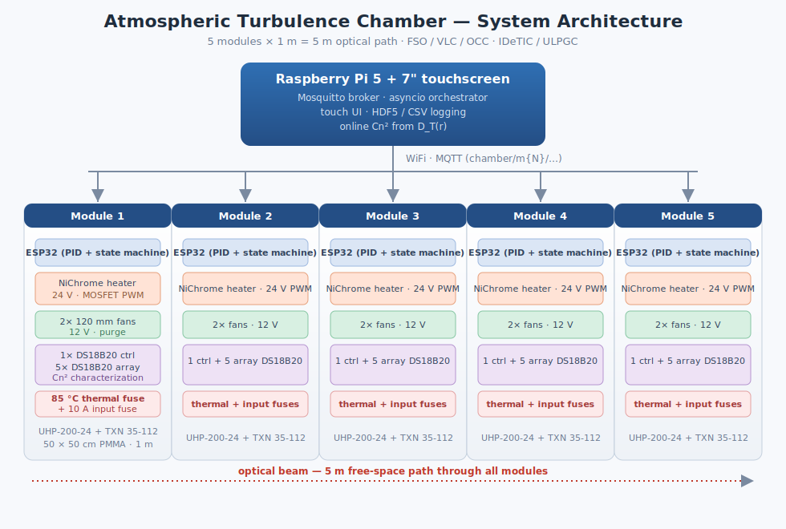

# Atmospheric Turbulence Chamber

A **5-module atmospheric turbulence chamber** for **Free-Space Optical (FSO)**,
**Visible Light Communication (VLC)**, and **Optical Camera Communication (OCC)**
experiments at **IDeTIC / ULPGC**.

The chamber generates controlled, repeatable optical turbulence over a 5 m
free-space path so we can measure how it degrades an optical link — and relate
that degradation to a measured refractive-index structure constant **Cn²**.

> **New here?** Read [`PROJECT_SEED.md`](PROJECT_SEED.md) first — it is the
> authoritative snapshot of locked-in decisions, hardware state, and roadmap.
> This README is the map; the seed is the territory.

---

## Architecture



Five **1 m modules** (50 × 50 cm PMMA cross-section) form a 5 m optical path.
Each module is electrically self-contained and controlled by its own **ESP32**,
which talks **MQTT over WiFi** to a central **Raspberry Pi 5**:

- **Turbulence generation** — a serpentined **NiChrome heater wire** on the
  module floor, PWM-driven through a MOSFET off a 24 V Meanwell PSU, creating
  thermal convection and refractive-index fluctuations.
- **Characterization** — a vertical array of **5 DS18B20** sensors on the side
  wall estimates **Cn²** from the temperature structure function `D_T(r)`.
- **Closed-loop control** — one DS18B20 near the wire feeds a per-module **PID**
  on the ESP32; a hardware/firmware **safety layer** cuts the heater on
  over-temperature, sensor loss, or broker timeout.
- **Forced mixing** — two 120 mm fans per module purge the chamber between runs.
- **Orchestration** — the Pi 5 hosts the **Mosquitto broker**, an **asyncio**
  orchestrator (per-module state mirror, purge coordination, data logging), a
  **touch UI**, and the **online Cn² analysis**.

### Scientific targets
| Quantity | Target |
|---|---|
| Heater surface temperature | 300–400 °C (hot, not glowing) |
| Air temperature gradient | ΔT 30–60 K |
| PMMA inner wall | < 60 °C (HDT ≈ 95 °C) |
| Operation | multi-hour, unattended, all safety checks passing |

---

## Repository layout

```
atmospheric-chamber/
├── PROJECT_SEED.md          ← authoritative project snapshot (read first)
├── README.md                ← this file
├── docs/                    ← per-topic docs + architecture.svg + datasheets
├── firmware/
│   └── esp32-module/        ← PlatformIO project (the MCU firmware)
├── orchestrator/            ← Raspberry Pi 5 Python package
├── analysis/                ← Cn² / Rytov / calibration notebooks
├── hardware/                ← KiCad, CAD, exported BOM
└── tools/                   ← flashing, log replay, sensor calibration
```

### Firmware (ESP32 — the per-module MCU)
`firmware/esp32-module/` is a PlatformIO + Arduino project. The control loop,
PID, safety cutoffs, and MQTT telemetry are implemented; purge/settle timing
and `STEADY_STATE` hysteresis are marked `TODO` for Phase 1.

```bash
cd firmware/esp32-module
cp secrets.ini.example secrets.ini      # fill in WiFi / broker / MODULE_ID
pio run -e esp32dev_38p                 # or esp32dev_30p (both stocked)
pio run -e esp32dev_38p --target upload
```

Pin map, PWM, and safety constants live in
[`include/board_config.h`](firmware/esp32-module/include/board_config.h).
Architecture: [`docs/05-firmware-architecture.md`](docs/05-firmware-architecture.md).

### Orchestrator (Raspberry Pi 5)
`orchestrator/` is a Python 3.11+ package. It subscribes to all chamber
telemetry, mirrors per-module state, exposes typed command publishers, and
computes Cn² online.

```bash
cd orchestrator
pip install -e .[dev]
python -m orchestrator        # connect to broker, mirror telemetry
pytest                        # unit tests (Cn² estimator, state mirror)
```

Broker config: [`src/orchestrator/broker_config/mosquitto.conf`](orchestrator/src/orchestrator/broker_config/mosquitto.conf).
Architecture: [`docs/06-orchestrator-architecture.md`](docs/06-orchestrator-architecture.md).

---

## MQTT interface

All topics under `chamber/`, module IDs `m1`…`m5`. The schema is defined once in
[`PROJECT_SEED.md` §7](PROJECT_SEED.md) and mirrored in code by
[`orchestrator/.../topics.py`](orchestrator/src/orchestrator/topics.py) and the
firmware's `mqtt_client.cpp`. Highlights:

- **Telemetry (ESP32 → Pi):** `chamber/m{N}/temps`, `/status`, `/fault`
- **Commands (Pi → ESP32):** `chamber/m{N}/cmd/{setpoint,fan,purge,stop,config}`
- **Broadcast:** `chamber/all/cmd/stop`, `chamber/all/cmd/purge`

Full table: [`docs/07-mqtt-schema.md`](docs/07-mqtt-schema.md).

---

## ⚠️ Safety

This is a high-temperature, mains-powered system. The safety constraints in
[`docs/04-safety.md`](docs/04-safety.md) / [`PROJECT_SEED.md` §8](PROJECT_SEED.md)
are **non-negotiable** and apply on the bench as well as in final operation:

- **85 °C thermal fuse** in series with every heater — never power a heater without it.
- **10 kΩ MOSFET gate pulldown** — heater is OFF at boot, reset, and firmware update.
- **10 A input fuse** per module on the 24 V rail.
- Firmware kill conditions: control > 90 °C, array > 60 °C, MQTT lost > 30 s,
  repeated sensor failure → heater 0 % / SAFE_OFF.
- NiChrome ≥ 8 cm from any PMMA surface, on ceramic standoffs.

---

## Roadmap

| Phase | Goal |
|---|---|
| **0** | Single-module bench validation: PWM under load, 1-Wire reads, fan switching, MQTT round-trip |
| **1** | Safety state machine, PID tuning, purge sequence, HDF5 logging, mechanical mounts |
| **2** | Scale to 5 modules: provisioning, full touch UI, coordinated purge, Cn² array |
| **3** | Characterization: sensor calibration, step-response gains, first Cn² + FSO/VLC runs |

Detail: [`PROJECT_SEED.md` §10](PROJECT_SEED.md).

---

*Maintainer: Vicente (IDeTIC / ULPGC). Questions go in issues, not in the docs.*
